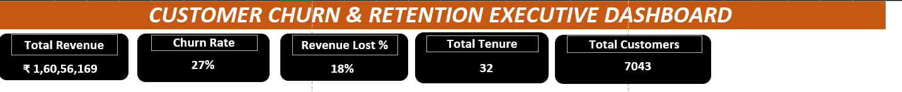
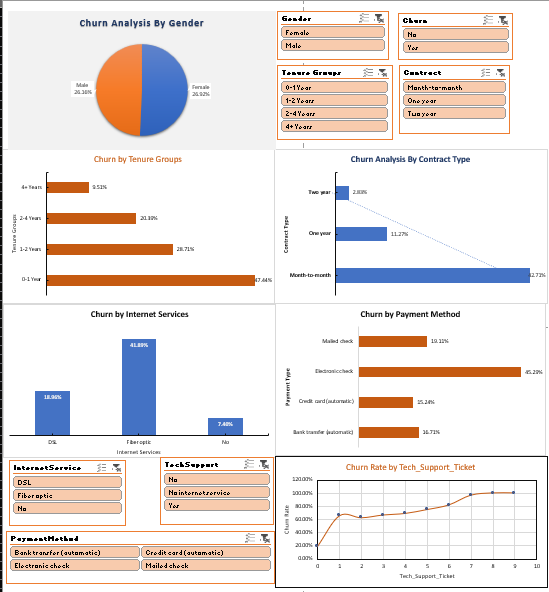

# 📊 Telecom Customer Churn & Retention Analytics Dashboard

An end-to-end data analysis and interactive Excel dashboard project analyzing customer attrition patterns, financial impact, and retention drivers for a telecommunications provider.

---

## 📌 Project Overview
Customer churn directly impacts business revenue and long-term sustainability. This project explores customer demographics, service plans, payment methods, and customer support tickets to identify the root causes of customer churn and deliver actionable recommendations for customer retention.

---

## 🗂️ Workbook Architecture & Data Pipeline

The Excel workbook is structured systematically to maintain data integrity and clear analytical workflows:

1. **`01 Churn-Dataset`**: Raw telecommunications dataset containing customer records and service attributes.
2. **`Clean_Data`**: Processed data tab with cleaned metrics, handled nulls, and standard formatting.
3. **`Customer_demographics`**: Pivot tables analyzing churn across gender, senior citizen status, and tenure brackets.
4. **`Service And Payment Analysis`**: Data aggregation breaking down churn by internet plan, streaming services, and payment channels.
5. **`Customer Support and Risk Analy`**: Analysis linking technical support ticket counts to customer attrition risk.
6. **`KPI and churn Analysis`**: Executive financial calculations (Revenue Lost, Churn Rate %, Average Monthly Charges).
7. **`Dashboard`**: Interactive executive interface featuring dynamic slicers and KPI summary cards.

---

## 📈 Dashboard Screenshots

### Executive Banner & Key Metrics

### Dynamic Dashboard & Diagnostic Visualizations

---

## 💡 Executive Summary & Key Findings

### 1. Key Performance Indicators (KPIs)
* **Total Revenue Generated:** ₹1,60,56,169 across **7,043** total customers.
* **Overall Churn Rate:** **26.5%** (1,869 customers lost).
* **Financial Impact:** Revenue loss due to churn reached **₹28,62,927** (**17.8%** of total revenue).
* **Customer Baseline:** Average tenure is **32.4 months** with an average monthly charge of **₹64.76**.

### 2. Critical Root-Cause Drivers
* **Contract Type:** Month-to-month contracts experience a massive **42.7% churn rate**, compared to **11.3%** for 1-year and **2.8%** for 2-year contracts.
* **Support Ticket Bottleneck:** Customers opening **1 or more technical support tickets** show a severe jump in churn (**>65% churn rate**), signaling friction in issue resolution.
* **Service Disparity:** **Fiber Optic** internet subscribers churn at **41.9%**, significantly higher than DSL users (**19.0%**).
* **First-Year Vulnerability:** Customers in their first year (**0–1 Year Tenure**) represent the single highest churn risk group (**47.4%**).

---

## 🎯 Strategic Recommendations

1. **Contract Conversion Incentives:** Implement targeted discounts and loyalty perks to transition high-risk Month-to-Month customers onto 1-year or 2-year contracts.
2. **Support Ticket Resolution SLAs:** Create priority escalation pathways and proactive outreach for customers opening technical tickets to resolve dissatisfaction early.
3. **Fiber Optic Service Review:** Conduct an infrastructure and pricing review for Fiber Optic services to fix quality/pricing pain points.
4. **90-Day Early Retention Onboarding:** Establish a structured first-year onboarding program to increase retention during the critical 0–12 month window.

---

## 🛠️ Tools & Technologies Used
* **Microsoft Excel**: Pivot Tables, Data Modeling, Formulas, Custom Formatting, Dynamic Slicers.
